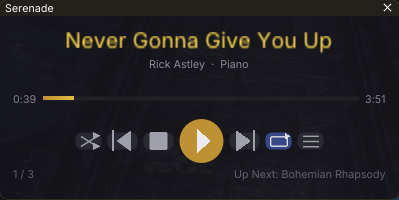
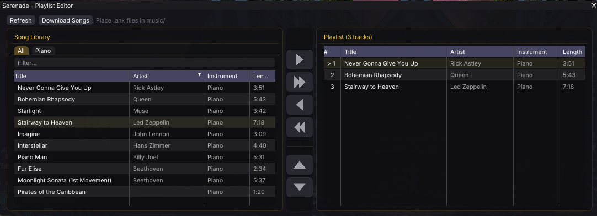

# Serenade

A Guild Wars 2 addon for [Raidcore Nexus](https://raidcore.gg/Nexus) that automates in-game instrument playback. Only the Ornate Grand Piano has been tested, but it should work for other instruments if you acquire songs designed for them.

## AI Notice

This addon has been 100% created in [Windsurf](https://windsurf.com/) using Claude. I understand that some folks have a moral, financial or political objection to creating software using an LLM. I just wanted to make a useful tool for the GW2 community, and this was the only way I could do it.

If an LLM creating software upsets you, then perhaps this repo isn't for you. Move on, and enjoy your day.

## Screenshots




## Features

- **Music Player** — play/pause, stop, next/previous, shuffle, repeat (off/all/one)
- **Playlist Editor** — dual-pane UI with song library and curated playlist
- **Ornate Grand Piano** — tuned for piano playback with chord support and 3 octaves
- **Track downloading** — download tracks from this repository's music directory from within game.

## Adding Songs

### AHK format (recommended)

AutoHotkey scripts with explicit `SendInput` and `Sleep` commands provide the most accurate playback.

You can get AHK scripts from:
- [gw2opus Tabify](https://tabify.gw2opus.com/)
- [gw2mb.com](http://gw2mb.com)

Add `#` or `;` metadata comment lines at the top:

```ahk
# title: Moonlight Sonata
# author: Beethoven
# instrument: piano
SendInput {Numpad0}
SendInput {Numpad3}
Sleep, 395
SendInput {Numpad6}
Sleep, 395
...
```
### Directory structure

```
addons/Serenade/music/
├── Moonlight_Sonata.ahk
├── Fur_Elise.ahk
└── Some_Song.txt
```

## Default Keybind

| Keybind | Action |
|---------|--------|
| `Ctrl+Shift+M` | Toggle player window |

## Building

### DLL (Windows addon)

Requires CMake 3.20+ and MinGW cross-compiler (`x86_64-w64-mingw32-g++`):

```bash
mkdir build && cd build
cmake .. -DCMAKE_TOOLCHAIN_FILE=../cmake/mingw-w64-x86_64.cmake -DCMAKE_BUILD_TYPE=Release
make
```

Produces `build/Serenade.dll`.

## Installation

1. Install [Nexus](https://github.com/RaidcoreGG/Nexus/releases)
2. Copy `Serenade.dll` into `<GW2>/addons/`
3. Place `.ahk` song files in `<GW2>/addons/Serenade/music/`
4. Launch GW2 — Serenade appears in the Nexus quick access bar

## Usage

1. Equip the **Ornate Grand Piano** in-game
2. Click the music note icon in the Nexus toolbar (or press `Ctrl+Shift+M`)
3. Open the Playlist Editor to add songs from the library
4. Use the download button to download songs from this repository's music directory
5. Press Play — the addon sends keypresses to GW2 to play the notes
6. If you need to chat, press Enter — playback stops automatically

## License

This software is provided as-is, with absolutely no warranty of any kind. Use at your own risk. It might delete your files, melt your PC, burn your house down, or cause world peace. Probably not that last one, but we can hope.
